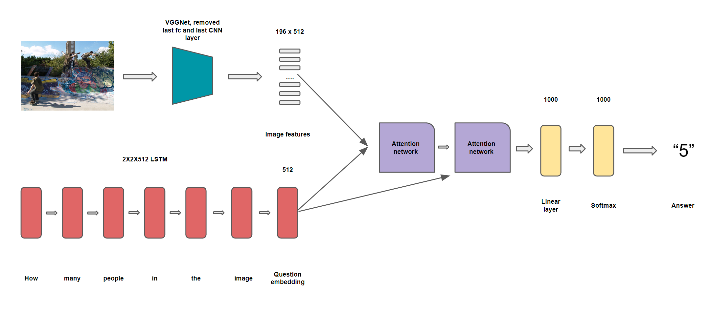
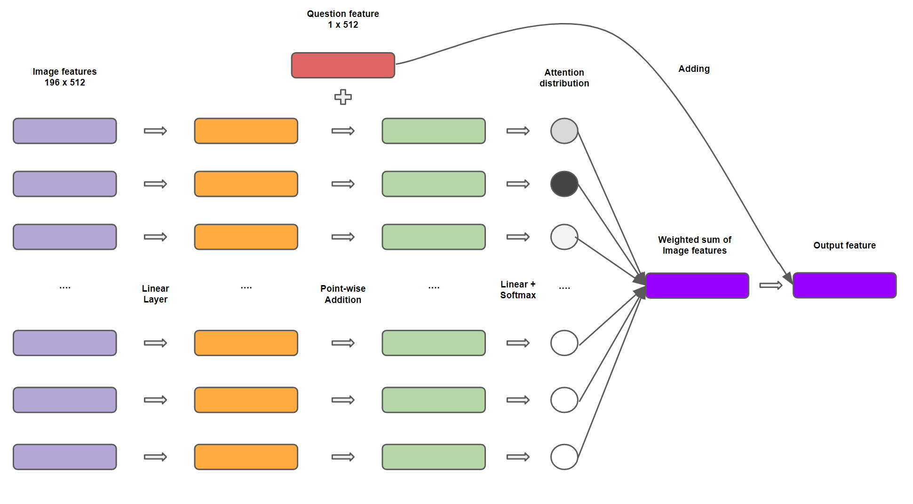

# Visual Question Answering with Deep Learning

Task 
-------------------------------------------------
The Visual question answering is the task of predict ing a natural-language answer given an image and a natural-language question.

An example input is as follows


An example data in the dataset is like 


What we expected from a model is natrual language answers with confidence probablities. 

Results
------------------------------------------------

| Models            | all   | yes/no | number  | other |
|-------------------|-------|--------|---------|-------|
| Majority vote     | 32.36 | 64.42  | 26.93   | 9.38  |
| VQA original      | 44.37 | 65.30  | 29.82   | 32.28 |
| CLIP-adpated      | 44.15 | 65.04  | 33.05   | 31.19 |
| Attention-adpated | 44.70 | 68.04  | 30.97   | 30.56 |

Model Structure 
------------------------------------------------
The best model, attention-adpated VQA has the following model structure: 



in which ```Attenion network``` has the following structure: 


