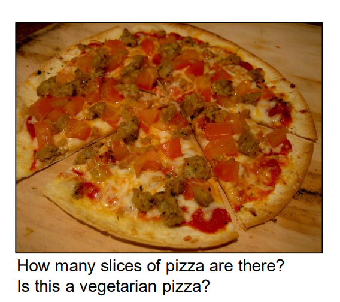
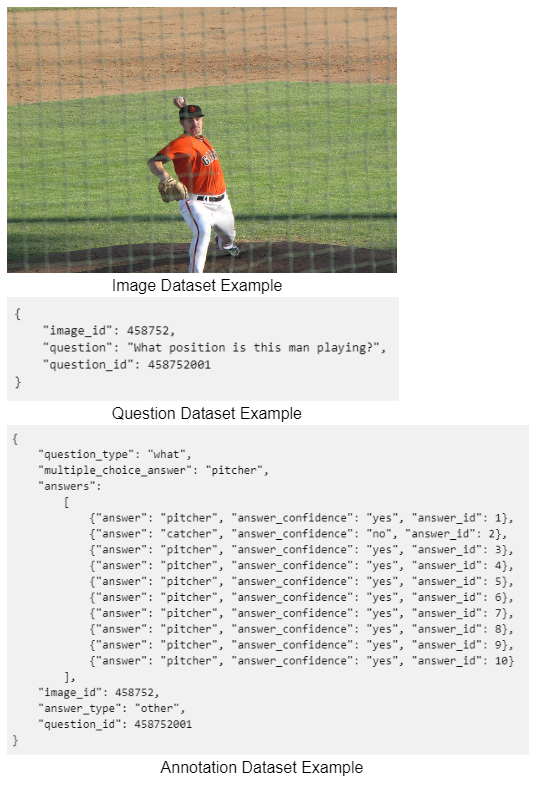

# Visual Question Answering with Deep Learning

Task 
-------------------------------------------------
The Visual question answering is the task of predict ing a natural-language answer given an image and a natural-language question.

An example input is as follows

An example data in the dataset is like 

What we expected from a model is natrual language answers with confidence probablities. 
